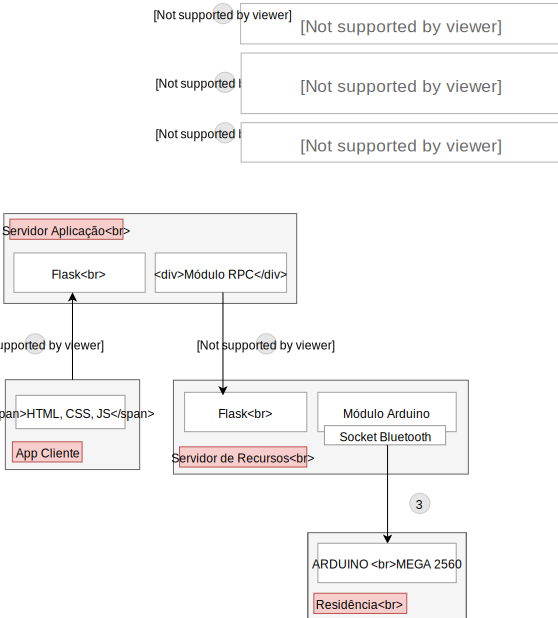

# Automação Residencial com Arduino

Projeto desenvolvido para a disciplina Sistemas Distribuídos do curso de Tecnologia em Sistemas para Internet.

[Página do projeto](https://guilhermedomith.github.io/Automacao_Residencial/)

## Dependências
- [Python 3](https://www.python.org/) ou superior;
- [Flask](http://flask.pocoo.org/);
- [PyCryptodome](https://pypi.org/project/pycryptodome/)
- [PyBluez](https://github.com/karulis/pybluez)

## Arquitetura do Projeto

A proposta do trabalho foi desenvolver um sistema utilizando os princípios de Sistemas Distribuídos para integrar o Arduino como um recurso remoto. Para este trabalho foi desenvolvido um sistema de automação residencial.

Utilizamos componentes do Arduino para representar os eletrônicos presentes em uma residência como alarme, lâmpadas e outros. Foram utilizadas chamadas de procedimentos remotas (RPC) para controlar os componentes da residência.

> Figura 1 \- Arquitetura do projeto

